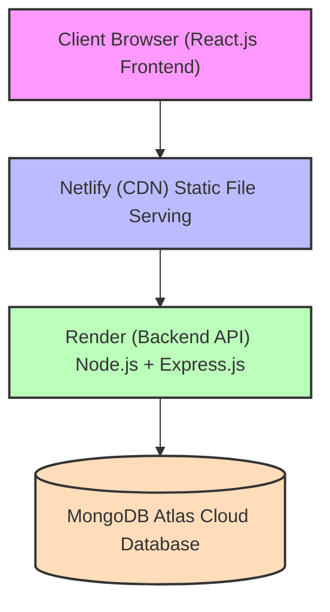

# 🍕 DACRES LANE - Complete Food Delivery Platform

## 📌 Project Overview

**DACRES LANE** is a complete, production-ready food delivery web application built with the MERN stack (MongoDB, Express.js, React.js, Node.js). It provides a seamless experience for users to browse food items, place orders, and track deliveries, while giving administrators full control over menu management and order processing.

### 🎯 Why This Project?

This project demonstrates a full-stack application with:
- Complete user authentication system
- Interactive shopping cart
- Real-time order tracking
- Full admin dashboard
- Responsive design for all devices
- Production-ready deployment

---

## 🚀 Live Demo

| Platform | URL |
|----------|-----|
| **Frontend (Live App)** | [https://dareslane.netlify.app](https://dareslane.netlify.app) |
| **Backend API** | [https://dacres-lane.onrender.com/api](https://dacres-lane.onrender.com/api) |
| **GitHub Repository** | [https://github.com/tharnab/DACRES-LANE](https://github.com/tharnab/DACRES-LANE) |

---

## 🔑 Demo Credentials

### 👑 Admin Access (Full Control)
| Field | Value |
|-------|-------|
| **Email** | `admin@admin.com` |
| **Password** | `adminisaadmin` |

**Admin Can:**
- View all customer orders
- Update order status (Pending → Confirmed → Preparing → Out for Delivery → Delivered)
- Add new food items to menu
- Edit existing food items
- Delete food items
- View all registered users
- See dashboard statistics

### 👤 User Access
| Field | Value |
|-------|-------|
| **Email** | Create your own account (any email works) |
| **Password** | Create your own password (min 6 characters) |

**User Can:**
- Browse food menu by categories
- Add items to cart
- Update cart quantities
- Place orders
- Track order status
- View order history
- Edit profile

---

## 📱 Device Support

| Device | Support Level | Recommendation |
|--------|--------------|----------------|
| **Laptop/Computer** | ✅ Full Support | Best experience, especially for Admin Dashboard |
| **Tablet** | ✅ Good Support | Most features work |
| **Mobile Phone** | ✅ Basic Support | Browse menu, add to cart works. Admin features limited |

> **⚠️ Note:** For the best experience, especially to use Admin Dashboard features, please use a laptop or computer.

---

## ✨ Features

### 👤 User Features

| Category | Features |
|----------|----------|
| **Authentication** | • User Registration & Login<br>• JWT Token-based Authentication<br>• Password Encryption (bcrypt)<br>• Session Management |
| **Food Browsing** | • Browse menu by categories (Breakfast, Lunch, Dinner, Evening Snacks, Beverage)<br>• Search food items<br>• Filter by Veg/Non-Veg<br>• View food details (price, description, rating)<br>• See Bestseller badge on high-rated items |
| **Cart Management** | • Add items to cart<br>• Update quantity<br>• Remove single items<br>• Clear entire cart<br>• Real-time cart total calculation<br>• Cart persists after login |
| **Order Management** | • Place orders from cart<br>• View order history<br>• Track order status<br>• Copy tracking ID for order tracking<br>• View order details |
| **User Profile** | • View profile information<br>• Edit profile (name, email)<br>• Change password<br>• View account creation date<br>• Logout |

### 👑 Admin Features

| Category | Features |
|----------|----------|
| **Dashboard** | • View total orders count<br>• View pending orders count<br>• View total menu items<br>• View available items count<br>• Real-time statistics |
| **Order Management** | • View all customer orders<br>• Filter orders by status<br>• Update order status<br>• View customer details<br>• View order items |
| **Menu Management** | • Add new food items<br>• Edit existing food items<br>• Delete food items<br>• Update price, description, availability<br>• Set Veg/Non-Veg status<br>• Set category<br>• Add image URLs<br>• Set rating |
| **User Management** | • View all registered users<br>• View user details |

---

## 🛠️ Tech Stack

### Frontend
| Technology | Purpose | Version |
|------------|---------|---------|
| **React.js** | UI framework | 18.x |
| **React Router DOM** | Navigation & routing | 6.x |
| **Bootstrap 5** | Styling & responsiveness | 5.x |
| **Framer Motion** | Animations & transitions | 10.x |
| **Axios** | API calls | 1.x |
| **React Hot Toast** | Notifications | 2.x |
| **Vite** | Build tool | 4.x |

### Backend
| Technology | Purpose | Version |
|------------|---------|---------|
| **Node.js** | Runtime environment | 18.x |
| **Express.js** | Web framework | 4.x |
| **MongoDB Atlas** | Database | Cloud |
| **Mongoose** | ODM for MongoDB | 7.x |
| **JWT** | Authentication | 9.x |
| **bcryptjs** | Password hashing | 2.x |
| **express-validator** | Input validation | 6.x |
| **express-rate-limit** | Rate limiting | 6.x |
| **helmet** | Security headers | 7.x |
| **compression** | Response compression | 1.x |
| **cors** | Cross-origin requests | 2.x |

### Deployment
| Platform | Purpose |
|----------|---------|
| **Render** | Backend hosting (free tier) |
| **Netlify** | Frontend hosting (free tier) |
| **MongoDB Atlas** | Database hosting (free tier) |

---

## System Architecture



### How It Works

1. **User visits the website** - Netlify serves the React frontend
2. **User interacts with UI** - React components update state
3. **API calls are made** - Axios sends requests to Render backend
4. **Backend processes** - Express handles routes, middleware validates
5. **Database operations** - Mongoose queries MongoDB Atlas
6. **Response returns** - Data flows back to frontend
7. **UI updates** - React re-renders with new data

---

## 🔗 API Endpoints

### Authentication Routes (`/api/users`)

| Method | Endpoint | Description | Access |
|--------|----------|-------------|--------|
| POST | `/register` | Register new user | Public |
| POST | `/login` | Login user | Public |
| GET | `/me` | Get current user | Private |
| GET | `/` | Get all users | Admin only |
| GET | `/:id` | Get user by ID | Admin only |
| PUT | `/:id` | Update user | Private |
| DELETE | `/:id` | Delete user | Admin only |

### Food Routes (`/api/foods`)

| Method | Endpoint | Description | Access |
|--------|----------|-------------|--------|
| GET | `/` | Get all foods | Public |
| GET | `/:id` | Get food by ID | Public |
| GET | `/category/:category` | Get foods by category | Public |
| GET | `/search?query=` | Search foods | Public |
| GET | `/available` | Get available foods | Public |
| POST | `/` | Create food | Admin only |
| PUT | `/:id` | Update food | Admin only |
| DELETE | `/:id` | Delete food | Admin only |

### Cart Routes (`/api/cart`)

| Method | Endpoint | Description | Access |
|--------|----------|-------------|--------|
| GET | `/` | Get user cart | Private |
| POST | `/add` | Add item to cart | Private |
| PUT | `/update` | Update quantity | Private |
| DELETE | `/remove/:foodId` | Remove item | Private |
| DELETE | `/clear` | Clear cart | Private |

### Order Routes (`/api/orders`)

| Method | Endpoint | Description | Access |
|--------|----------|-------------|--------|
| POST | `/` | Create order | Private |
| GET | `/myorders` | Get user orders | Private |
| GET | `/all` | Get all orders | Admin only |
| GET | `/:id` | Get order by ID | Private/Admin |
| PUT | `/:id/status` | Update order status | Admin only |

---

## 💻 Installation Guide (For Developers Who Want to Fork)

### Prerequisites

| Software | Version | Download Link |
|----------|---------|---------------|
| Node.js | v14 or higher | [nodejs.org](https://nodejs.org/) |
| npm or yarn | Latest | Comes with Node.js |
| MongoDB Atlas Account | Free tier | [mongodb.com/atlas](https://www.mongodb.com/atlas) |
| Git | Latest | [git-scm.com](https://git-scm.com/) |

### Step 1: Fork the Repository

1. Go to [https://github.com/tharnab/DACRES-LANE](https://github.com/tharnab/DACRES-LANE)
2. Click the **Fork** button (top right)
3. Select your GitHub account
4. Wait for the fork to complete

### Step 2: Clone Your Fork

```bash
# Clone your forked repository
git clone https://github.com/YOUR_USERNAME/DACRES-LANE.git
```

# Navigate to project folder
cd DACRES-LANE

### Step 3: Backend Setup
# Navigate to backend folder
cd BACKEND

# Install dependencies
npm install

# Create .env file
echo "PORT=5000" > .env
echo "uri=your_mongodb_connection_string" >> .env
echo "JWT_SECRET=your_super_secret_key" >> .env

# Start Backend Server
npm run dev

### Step 4: Frontend Setup

# Open new terminal, navigate to frontend folder
cd ../FRONTEND

# Install dependencies
npm install

# Create .env file
echo "VITE_API_URL=http://localhost:5000/api" > .env

# Start frontend server
npm run dev

✅ Frontend runs on http://localhost:5173


---

## 📄 License

MIT License - feel free to use this project for learning and production!

---

**Built with ❤️ using MERN Stack**

⭐ If you like this project, please give it a star on GitHub!

📧 For questions or support: larnab66@gmail.com

